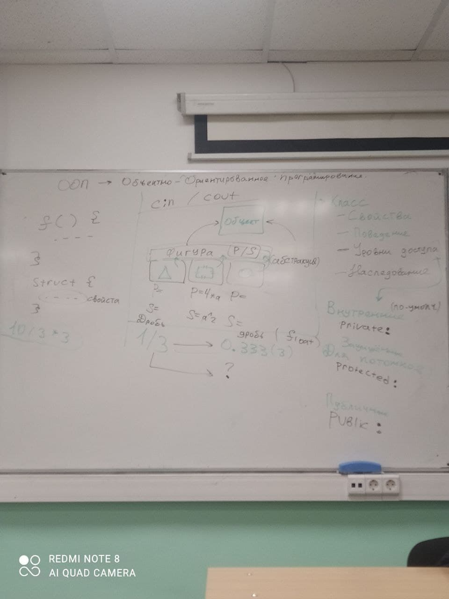
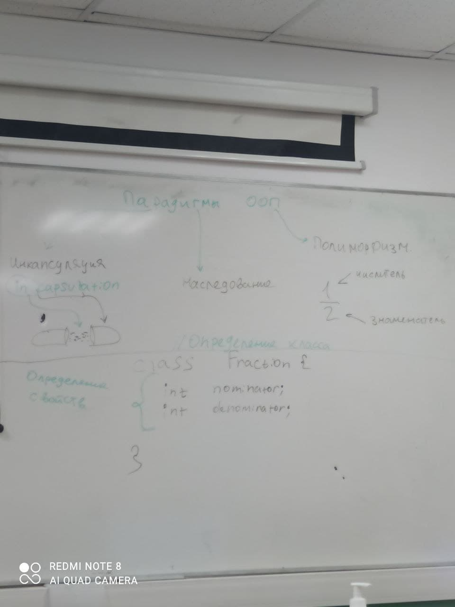

# Sixth-Lecture-CPP

Темы:
- ООП, ООП, Много ООП.

# ООП

ООП -> Объектно-Ориентированное Программирование.

# Класс
- Свойства
- Поведение Объекта
- Уровни Доступа
- Наследование

## Определения

# Парадигмы ООП

